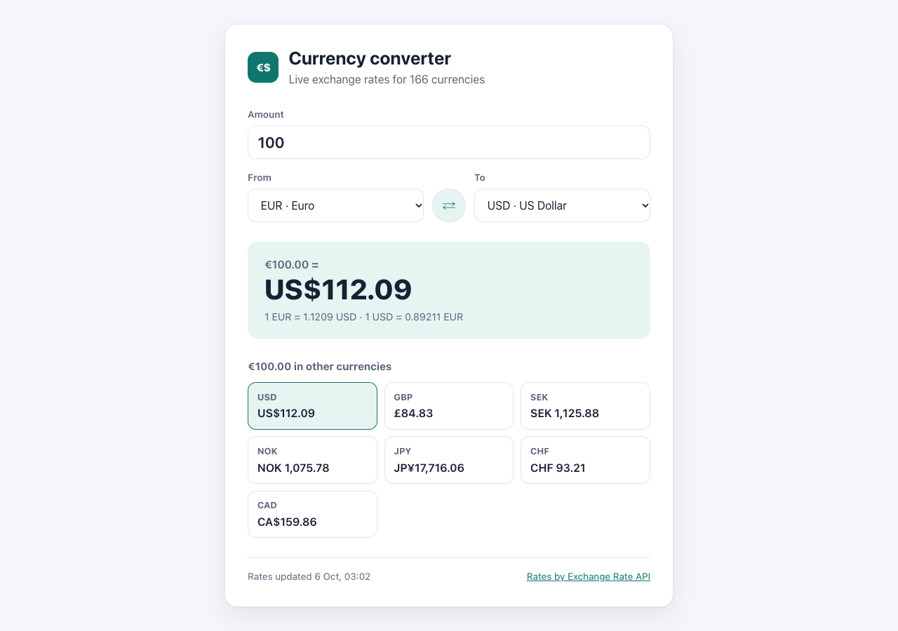
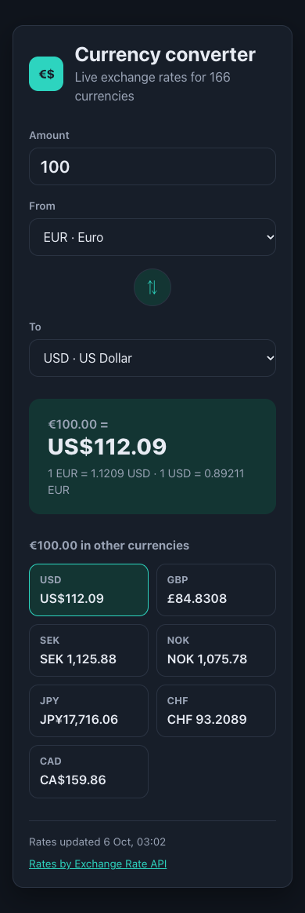

# Currency Converter

A React app that converts between 160+ currencies with live exchange rates from the [ExchangeRate-API](https://www.exchangerate-api.com/) open endpoint.

**🌐 Live:** [bitayeganeh.github.io/06-Exchange-rate-API](https://bitayeganeh.github.io/06-Exchange-rate-API/)



## Features

- **Convert any amount** between two currencies, with full currency names (e.g. "EUR · Euro")
- **Swap button** to flip the direction in one click
- **Both rates shown:** 1 EUR = … USD and 1 USD = … EUR
- **Popular currencies** (USD, GBP, SEK, NOK, JPY, CHF, CAD…) at a glance; click one to convert to it
- **Shows when the rates were last updated**
- **Remembers your last amount and currencies** between visits
- **Clear loading and error states**, with a "Try again" button
- **Responsive and dark-mode aware**

<p align="center"></p>

## Built with

- React (`useState`, `useEffect`, `useMemo`)
- Axios
- `Intl.NumberFormat` and `Intl.DisplayNames` for currency formatting and names
- Plain CSS with custom properties (light and dark themes)
- Vite

## Run locally

```bash
npm install
npm run dev
```

Deploy to GitHub Pages (builds and pushes `dist/` to the `gh-pages` branch):

```bash
npm run deploy
```
